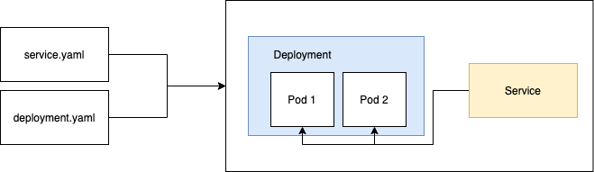
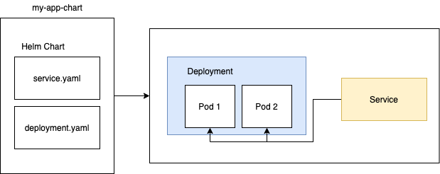
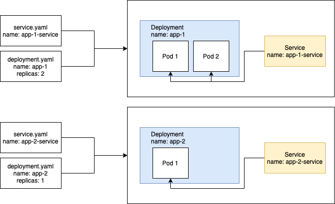
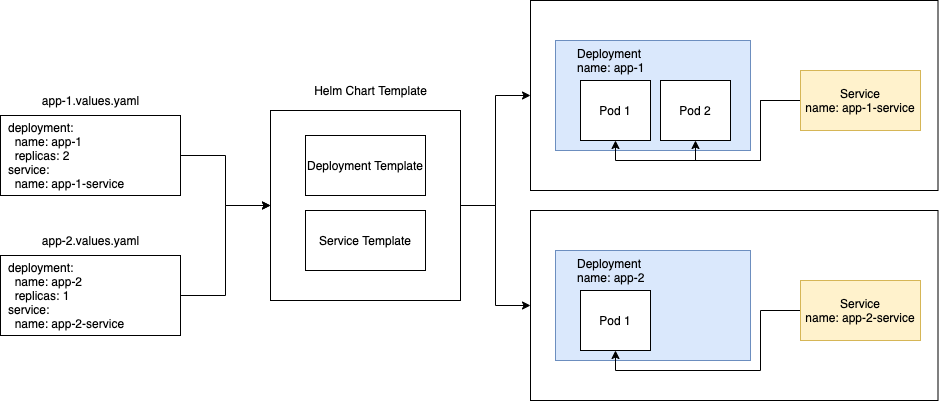

# Helm In Kubernetes — Part 1 Introduction


## What is Helm?

A Package Manager For Kubernetes
In simplest term, Helm is the package manager for Kubernetes, just like NPM for Node, Composer for PHP, Go Mod for Golang.

Let’s you want to deploy a simple app called my-app as followed.


In this simple example, you have to write 2 YAML files, 1 for service, 1 for deployment, which will manage the 2 pods. You have to run the following commands to deploy your app.

```
kubectl apply -f ./deployment.yaml
kubectl apply -f ./service.yaml
```
This is probably fine for simple app like this, but what if you have a more complex application which uses multiple YAML files like Service, StatefulSet, ConfigMap, Secret etc? Also, if you want to share your stack of applications, each person has to run multiple lines of command to deploy your application.

Instead of treating service.yaml and deployment.yaml separately, we bundle them together, like so. In Helm, the bundle of YAML files is known as Chart. You can then share your Helm Chart and others can easily install and deploy your application with a single command.

```
// helm install [NAME] [CHART]
helm install my-app my-app-chart
```



## 2. Template Engine
Helm comes with powerful templating feature. Rather than writing multiple YAML files for different deployment/service, you can use 1 template, and provide different values to your template to deploy different applications.

Let’s look at a simple example.

We have 2 apps, app-1 and app-2. app-1 has 2 replicas and app-1-service exposes the pods of app-1 . app-2 has 1 replica and app-2-service exposes the pods of app-2 . They are quite similar, still you have to write 4 YAML files to create the applications.

Helm allows you to do this instead.

Instead of creating individual deployment and service YAML files, we use templates for both. All we have to do provide different values to the template files, and Voilà, we have our applications ready. This method will start paying dividend when you have a lot of applications(app-3 , app-4 and so on) to deploy.

Assuming you have a Chart called my-app and you want to deploy my-app-1 and my-app-2 .

```
helm install my-app-1 my-app --values app-1.values.yaml
helm install my-app-2 my-app --values app-2.values.yaml
```
This also allows you enforce certain standard in your organisation. Perhaps you do not want other developers to change CPU limit themselves, you can then hardcode the value into the template file which they do not have edit access to.

## 3. Release Manager
Helm also allows you to manage releases, this includes deploying, upgrading, and rolling back your app.
```
// Installing(Deploying) a Chart
helm install [NAME] [CHART]
// Upgrading, [RELEASES] is basically the name of your app
helm upgrade [RELEASE][CHART]
// Rollback, if REVISION is not provided, it will rollback to previous version
helm rollback <RELEASE> [REVISION] [flags]
// Check the history of an app
helm history [NAME]
```
