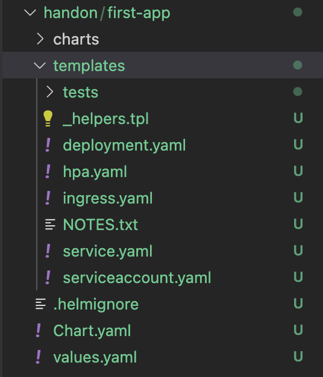
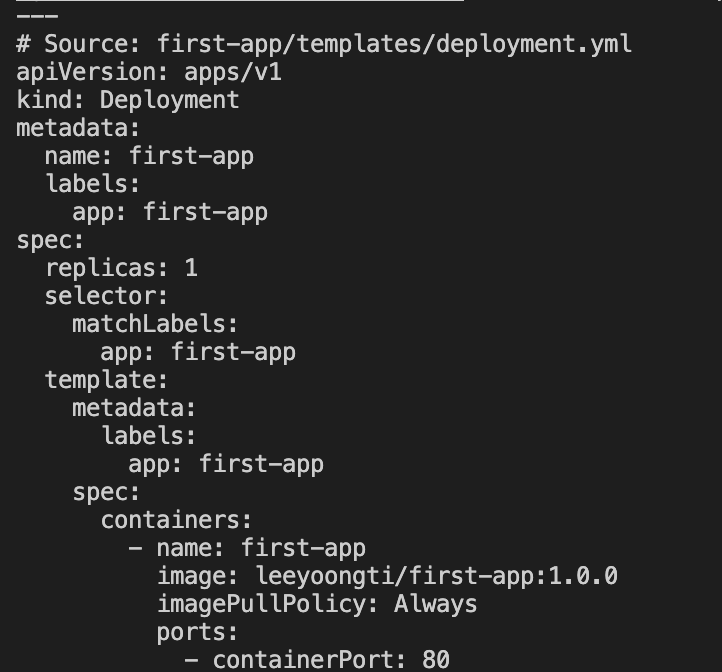

# Helm In Kubernetes — Part 2: How to create a simple Helm Chart

## Deploy the app using Kubectl

``` yml
apiVersion: apps/v1
kind: Deployment
metadata:
  name: first-app
  labels:
    app: first-app
spec:
  replicas: 1
  selector:
    matchLabels:
      app: first-app
  template:
    metadata:
      labels:
        app: first-app
    spec:
      containers:
        - name: first-app
          image: leeyoongti/first-app:1.0.0
          imagePullPolicy: Always
          ports:
            - containerPort: 80
```
A few key points:

* The deployment name is first-app(Line 4).
* The name of the container is also first-app (Line 19).
* The port for the container(the port that the app is running on) is 80 (Line 21).
* We can create a deployment using the YAML file by running:

```
kubectl apply -f apps/01-first-app/yml/deployment.yml
```

## Deploy the app using Helm Chart

1. Go to the directory that you want to create your Helm Chart and run:
`helm create first-app`
You will see a directory called first-app being created.

Let’s look at them one at a time.

* charts is where Chart dependencies stored.
* templates is where the templates for Deployment, Service, ConfigMap etc are stored.
* .helmignore basically like .gitignore , contains pattern to ignore when packaging a Helm Chart.
* Chart.yaml defines the information about your Chart
* values.yaml defines the values that will be used by the templates for your Chart.
First, delete everything under templates directory and copy the deployment.yaml from first-app and paste it under the templates directory, like so.
Now, run the following command to deploy the application, assuming we’re in devops directory:
```
// helm install [NAME] [CHART]
helm install first-app handon/first-app
```
* The first argument is the name we want for our Helm Chart deployment
* The second argument is the Chart we want to deploy.
You would see the following message being printed out

NAME: first-app
LAST DEPLOYED: Sun May 23 23:53:56 2021
NAMESPACE: default
STATUS: deployed
REVISION: 1
TEST SUITE: None
You can run the following command to list all the release made by Helm.

`helm list`

You can go back to Lens to check the deployment has successfully been made.

First, change templates/deployment.yaml in your Chart to the following:
```
apiVersion: apps/v1
kind: Deployment
metadata:
  name: {{ .Values.name }}
  labels:
    app: {{ .Values.name }}
spec:
  replicas: 1
  selector:
    matchLabels:
      app: {{ .Values.name }}
  template:
    metadata:
      labels:
        app: {{ .Values.name }}
    spec:
      containers:
        - name: {{ .Values.name }}
          image: {{ .Values.deployment.image }}:{{ .Values.deployment.tag }}
          imagePullPolicy: Always
          ports:
            - containerPort: {{ .Values.deployment.containerPort }}
```
Then, change the content of values.yaml in your Chart to this:

```
name: first-app
deployment:
  image: leeyoongti/first-app
  tag: 1.0.0
  containerPort: 80
```
When we want to inject values to a template, we need to define placeholders to let Helm knows where we want to put those values. In Helm, the placeholder looks like this: {{ .Values. }} .

Now try running the following command to see the file that Helm will generate based on the template and values we provide.

`helm template first-app`
And you will see

helm template is a powerful command that allows you to see the generated output whenever you are feeling unsure with your template/values.
We already have first-app:1.0.0 deployed, let’s do an upgrade. Go to values.yaml and change tag to 2.0.0 , like so
```
name: first-app
deployment:
  image: leeyoongti/first-app
  tag: 2.0.0
  containerPort: 80
```
Then run
`helm upgrade first-app first-app`

What if you want to do a rollback to 1.0.0? It’s simple. Run this command:
`helm rollback first-app`

You can check all your release for first-app by running:
`helm history first-app`
