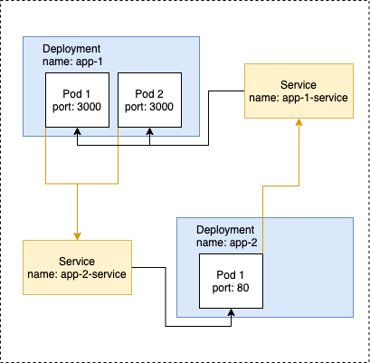

# Helm In Kubernetes — Part 3: Hand on with Flow Control and Pipelines
We have seen how we can create a simple Helm Chart. This time we are going to take a look at flow control and pipelines in Helm.

This is the app(2 apps actually) that we want to deploy.

We have app-1 and app-2 — 2 separate Node apps. On /service path of app-1 , it will curl app-2 root path. Likewise, On /service path of app-2 , it will curl app-1 root path. Take a look at the content of app-1 as an example. So we need some way to provide environment variable for the request address that we want to curl to our apps.
Both app-1 and app-2 are ready as Docker image, the image names are leeyoongti/node-web-app-1:1.0.2 and leeyoongti/node-web-app-2:1.0.2 respectively.

Let’s create our Helm Chart first. Run:

`helm create node-web-app`

Delete everything under the templates folder. Then, copy deployment.yml and service.yml inside 02-node-webapp/app-1/yml folder and paste them inside the templates folder so we don’t have to type everything from scratch.
Next, create 2 files named app-1.values.yaml and app-2.values.yaml . We will be using these files to inject values to our templates. Feel free to delete values.yaml file as we’re not going to use it.
Everything in the templates are hardcoded, let’s change that and define the values in the value files.

Edit app-1.values.yaml to the following:
```
name: app-1
deployment:
  image: leeyoongti/node-web-app-1
  tag: 1.0.2
  containerPort: 3000
  env: 
    - name: REQUEST_ADDRESS
      value: app-2-service
    - name: VERSION
      value: 1.0.2
service:
  type: NodePort
  port: 3000
  nodePort: 30111
  ```
  A few key points:

The app is running on port 3000.
The value for REQUEST_ADDRESS has to match whatever we provide when we are deploying the service for app-2 . Take a look at Line 4 in templates/service.yaml , we define the name of the service to be {{ .Values.name }}-service . So it means, when we are creating our app-2.values.yaml , we have to use app-2 as the name.
Usually we have to also define the port that we want to request, but app-2 is running on port 80, which is the default. So we do not have to specify it.
Edit app-2.values.yaml to the following:
```
name: app-2
deployment:
  replicas: 2
  image: leeyoongti/node-web-app-2
  tag: 1.0.0
  containerPort: 80
  env: 
    - name: REQUEST_ADDRESS
      value: app-1-service:3000
    - name: VERSION
      value: 1.1.0
service:
  type: NodePort
  nodePort: 30112
  ```
  A few key points:

We define the port for REQUEST_ADDRESS because app-1 is running on port 3000 instead of the default 80.
service.port is not defined for app-2. Later we will see in templates/service.yaml , we define a default value of 80 for it.
Edit templates/deployment.yaml to the following:
``` yml
apiVersion: apps/v1
kind: Deployment
metadata:
  name: {{ .Values.name }}
  labels:
    app: {{ .Values.name }}
spec:
  replicas: {{ .Values.deployment.replicas | default 1 }}
  selector:
    matchLabels:
      app: {{ .Values.name }}
  template:
    metadata:
      labels:
        app: {{ .Values.name }}
    spec:
      containers:
        - name: {{ .Values.name }}
          {{- with .Values.deployment }}
          image: {{ .image }}:{{ .tag }}
          ports:
            - containerPort: {{ .containerPort | default 80 }}
          {{- end }}
          env:
            {{- range .Values.deployment.env }}
            - name: {{ .name }}
              value: {{ .value }}
            {{- end }}
```
A few key points to cover here:

* | sign here(Line 8 and Line 22) is known as a pipeline. Pipeline is used to chain a sequence of function together. We use is here to set a default value of 1 to replicas and default value of 80 to container port. So we can choose not to provide value for replicas and it will default to 1. So, for our case, app-1.values.yaml does not provide value for replicas, so we will be deploying the app with 1 replica.
* with is used to specify a scope. Say we have image , tag and containerPort under the deployment scope (Check app-1.values.yaml Line 3–5). We can use with so that we do not have to define the value placeholder repeatedly, like so: .Values.deployment.image , .Values.deployment.tag , .Values.deployment.containerPort . We have to close the scope with end
* range is used to loop a list of values. We can define a list of values and use range to loop over them(Check app-1.values.yaml Line 6 — 10). We will close the loop with end on Line 28.
* spec.env is how we define environment variables for our app.
Edit templates/service.yaml to the following:
```
apiVersion: v1
kind: Service
metadata:
  name: {{ .Values.name }}-service
spec:
  {{ if .Values.service }}
  type: {{ .Values.service.type | default "NodePort" | quote }}
  selector:
    app: {{ .Values.name }}
  ports:
      # By default and for convenience, the `targetPort` is set to the same value as the `port` field.
    - port: {{ .Values.service.port | default 80 }}
      targetPort: {{ .Values.service.port | default 80 }}
      {{ if .Values.service.nodePort }}
      nodePort: {{ .Values.service.nodePort }}
      {{ end }}
  {{ else }}
  type: NodePort
  selector:
    app: {{ .Values.name }}
  ports:
    - port: 80
      targetPort: 80
  {{ end }}
  ```
  A few key points to cover for service.yaml

* On Line 6, we have a if keyword. This is to check whether service value is provided. If it is not provided, it will go to the else on Line 17. Which means, the output file will include Line 18–23, and not Line 7–15. In another word, service and all the values nested under it are optional.
* Again, we see pipeline and default in action to define a default value if the value is not provided. Port and target port will be set to 80 if service.port is not provided.
* Here we have something called quote . It is used to add quote to the value, i.e. NodePort will become "NodePort" .

Now, let’s try installing(deploying) our Helm Chart by running(Make sure you are running the command in the directory that you created your Helm Chart:

// helm install [NAME] [CHART]
helm install node-web-app-1 node-web-app

You will probably see an error like this.

Error: template: node-web-app/templates/deployment.yaml:8:22: executing "node-web-app/templates/deployment.yaml" at <.Values.deployment.replicas>: nil pointer evaluating interface {}.replicas

It says .Values.deployment is nil, what gives?

If we look back at our deployment.yaml file on Line 8, the template is expecting us to provide a directory called deployment , the template never check whether deployment exists before accessing the replicas value.

Also, since we deleted values.yaml , we need to tell Helm which value file we want to use to install the app. So we should run this command instead:

```
helm install node-web-app-1 node-web-app --values ./node-web-app/app-1.values.yaml
```