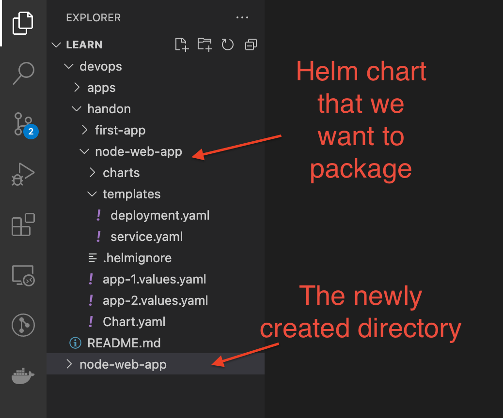
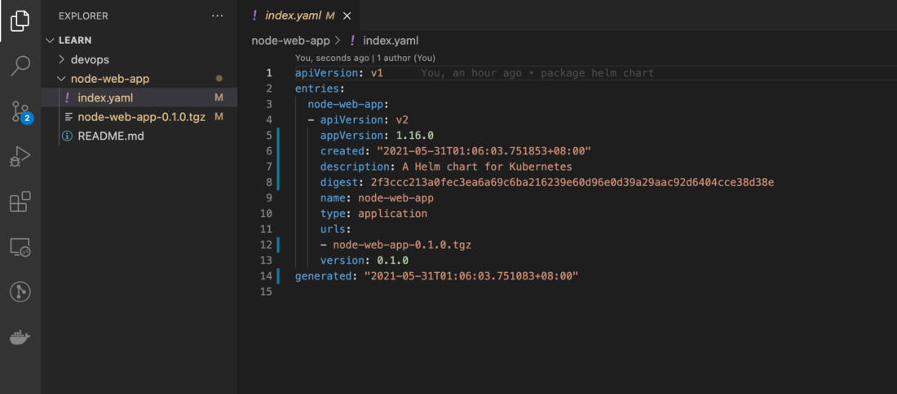

# Helm In Kubernetes — Part 4: Publish Helm Chart To Artifact Hub using Github Pages

## 1. Package Helm chart

1. The first step is to package our node-web-app Helm chart. Create a new directory called node-web-app

2. Run the following command to package the node-web-app Helm chart. You may have slightly different command depending on the location

`helm package devops/handon/node-web-app`

3. mv node-web-app-0.1.0.tgz node-web-app

4. Create index.yaml
A valid Helm chart requires an index file. We can use Helm to create an index.yaml for us by:
helm repo index node-web-app

5. add this to Git hub repo

6. ......

